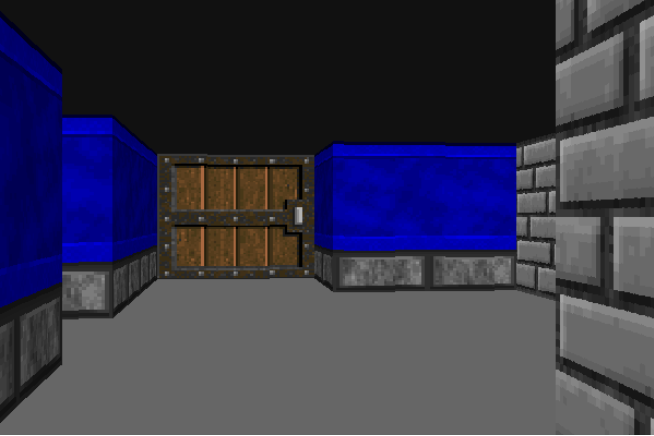

# Demo Ray Casting

Repositori ini berisi contoh demo untuk [teknik ray casting](https://en.wikipedia.org/wiki/Ray_casting), sebagaimana dipopulerkan oleh _Wolfenstein 3-D_, yang dibahas di Hijra Engineering Talk tanggal 13 April 2022 yang silam.



Yang dibutuhkan: [Node.js](https://nodejs.org/) versi 12 atau lebih baru.

Langkah pertama, pasang semua dependensi terlebih dahulu:

```
npm install
```

Lalu jalankan:

```
npm start
```

yang akan membuka browser untuk menampilkan demo raycasting tersebut.

Untuk mengubah posisi pemain, gunakan AWSD (`w` dan `s` untuk maju atau mundur, `a` and `d` untuk menengok ke kiri atau ke kanan).